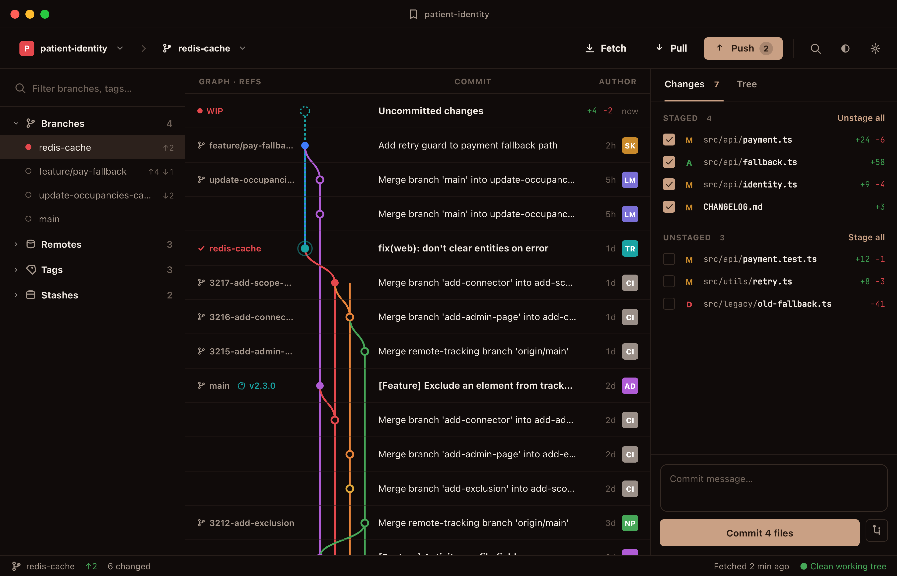
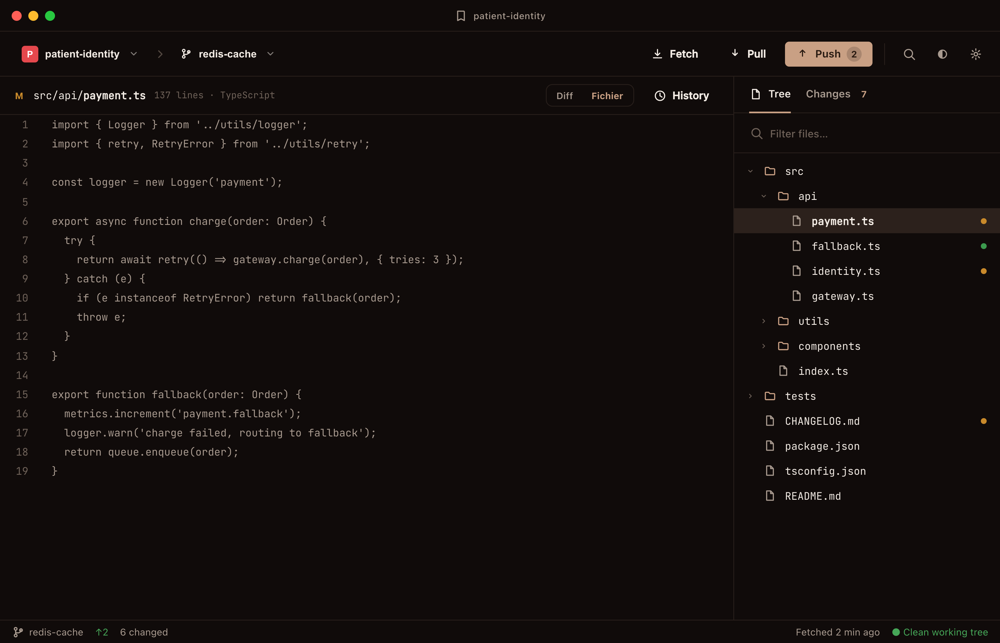
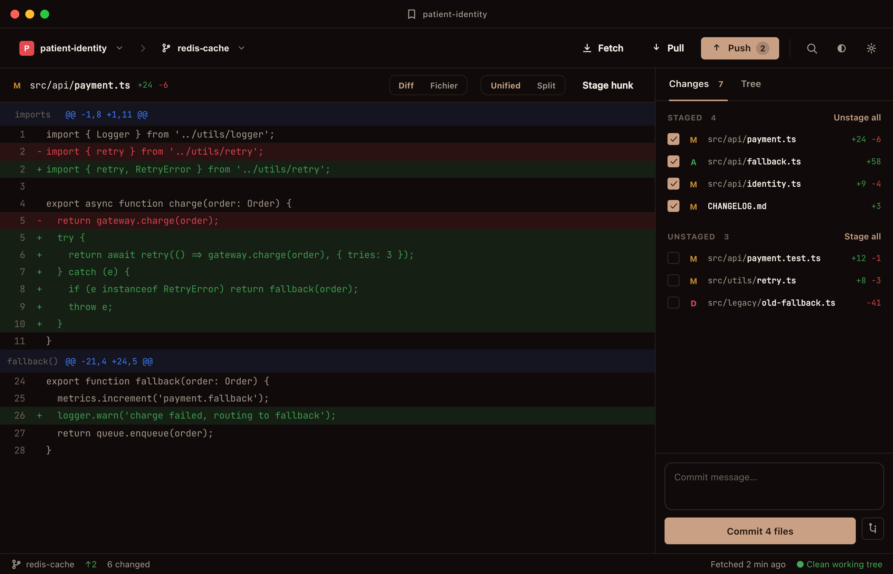
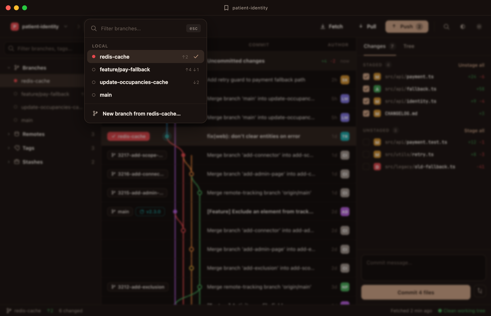
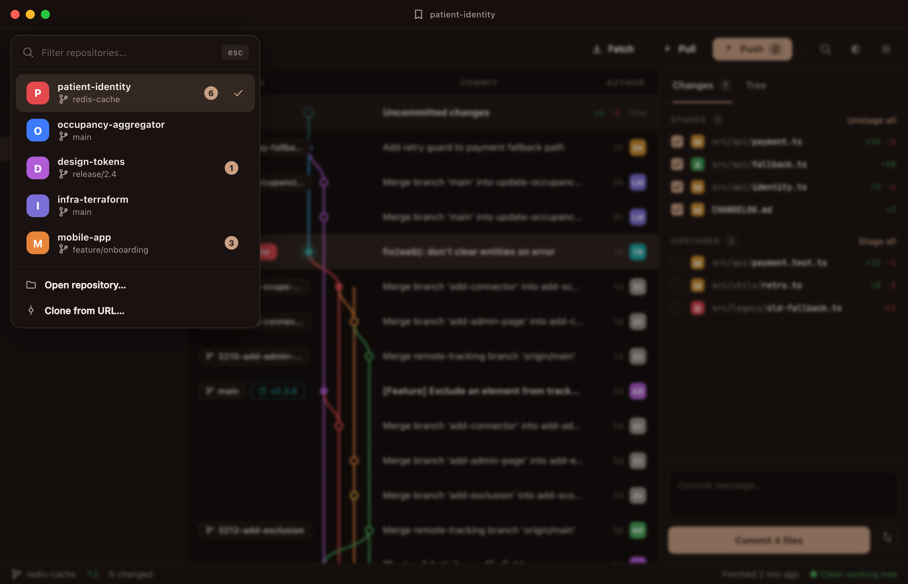

# Mockups

These are **starting mockups** — a snapshot of the direction gitoui is aiming for, not the
final or implemented design. They exist to convey the **overall feel** (layout, density, the
graph as protagonist, the source-tinted palette), not a pixel-exact specification. Details such
as exact spacing, copy, iconography, and the dark/light balance will shift as the UI is built.

For the actual, authoritative design system — tokens, typography, components, named rules — see
[`DESIGN.md`](../../DESIGN.md). When a mockup and `DESIGN.md` disagree, `DESIGN.md` wins.

A few things worth knowing while reading them:

- They are shown in **dark mode**, but light and dark are equal citizens (see `DESIGN.md`); the
  whole palette is derived at runtime from one user-chosen source color.
- Stray localized labels (e.g. `Fichier`) are incidental to the mockup, not a spec decision.
- The code / diff / file-tree views show a direction that grows over time; early iterations
  focus on diffs.

## Index

| Mockup | What it shows |
| --- | --- |
|  | The default surface: repository rail, the commit **graph** (the protagonist), and the `Changes` inspector with staging + commit. |
|  | File-content view with the `Tree` file browser in the inspector. |
|  | Unified/Split diff with `Stage hunk`, additions/deletions as low-alpha tinted lines. |
|  | The branch switcher overlay (local branches, filter, "new branch from…"). |
|  | The repository switcher overlay with identity-colored repo avatars. |
